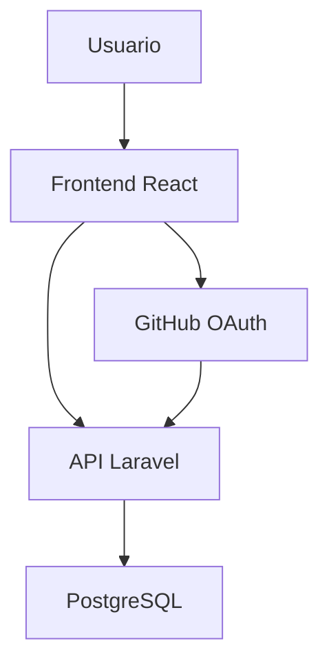
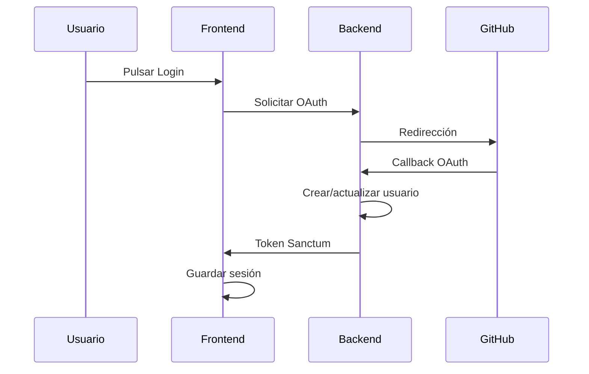

# Documentación Técnica - DADOS DE NESUS

## 1. Introducción

### 1.1 Descripción del proyecto

DADOS DE NESUS es una aplicación web orientada a la gestión y creación de personajes para partidas de rol, especialmente inspirada en sistemas como Dungeons & Dragons 5ª Edición.

La aplicación permite a los usuarios autenticarse, gestionar personajes, consultar información relacionada con razas, clases y estadísticas, así como almacenar y recuperar la información necesaria para la creación y mantenimiento de fichas de personaje.

### 1.2 Objetivos

- Centralizar la gestión de personajes de rol.
- Facilitar la creación y edición de fichas.
- Proporcionar autenticación segura mediante GitHub.
- Exponer una API REST para el acceso a los datos.
- Aplicar una arquitectura MVC.

---

# 2. Arquitectura del sistema

## 2.1 Arquitectura general

El proyecto sigue una arquitectura cliente-servidor compuesta por:

- Frontend SPA desarrollado en React.
- Backend API REST desarrollado con Laravel.
- Base de datos PostgreSQL.
- Autenticación mediante Laravel Sanctum y GitHub OAuth.
- Despliegue mediante Docker.



---

## 2.2 Tecnologías utilizadas

### Frontend

| Tecnología   | Uso                   |
| ------------ | --------------------- |
| React 19     | Interfaz de usuario   |
| React Router | Navegación            |
| Axios        | Explotacion de la API |
| Vite         | Bundler               |
| Tailwind CSS | Estilos               |
| DaisyUI      | Componentes visuales  |

### Backend

| Tecnología | Uso               |
| ---------- | ----------------- |
| Laravel 13 | API REST          |
| PHP 8.3    | Lenguaje backend  |
| Sanctum    | Autenticación     |
| Socialite  | Login con GitHub  |
| Swagger    | Documentación API |
| Docker     | Contenerización   |

### Base de datos

- PostgreSQL

---

# 3. Arquitectura Backend

## 3.1 Organización

El backend sigue la arquitectura MVC de Laravel.

```text
app/
     Http/
        Controllers/
        Requests/
        Resources/
        Models/
```

### Controllers

Gestionan la lógica de negocio.

Controladores principales:

- AuthController
- userController
- characterController
- statController
- itemController
- FormOptionsController

### Models

Modelos identificados:

- User
- Character
- Stat
- Item
- Race
- Subrace
- Clase
- Subclass
- Background
- Passive
- Spell
- Role
- Manual
- Folder
- Feat

### Resources

Responsables de formatear la información devuelta por la API.

### Requests

Implementan validación de entrada de datis.

---

# 4. Arquitectura Frontend

## 4.1 Organización

```text
src/
├── components/
├── context/
├── pages/
├── assets/
└── api.js
```

## 4.2 Componentes principales

### ProtectedRoute

Protege rutas privadas mediante comprobación de autenticación.

### AuthContext

Gestiona el estado global de autenticación del usuario.

### API Service

Centraliza las peticiones HTTP realizadas mediante Axios.

---

## 4.3 Páginas

### Login

Pantalla de acceso al sistema.

### AuthCallback

Procesa la respuesta del login mediante GitHub OAuth.

### Dashboard

Página principal tras la autenticación.

### CharacterSheet

Visualización y edición de fichas.

---

# 5. Autenticación y seguridad

## 5.1 GitHub OAuth

La autenticación se realiza mediante GitHub utilizando Laravel Socialite.

### Flujo



## 5.2 Laravel Sanctum

Una vez autenticado:

- Se genera un token.
- El token se utiliza para acceder a las rutas protegidas.
- Todas las operaciones de escritura requieren autenticación.

---

# 6. API REST

## 6.1 Usuarios

### Obtener usuarios

```http
GET /api/users
```

### Obtener usuario

```http
GET /api/users/{id}
```

### Crear usuario

```http
POST /api/users
```

### Actualizar usuario

```http
PUT /api/users/{id}
```

### Eliminar usuario

```http
DELETE /api/users/{id}
```

---

## 6.2 Personajes

### Obtener personajes

```http
GET /api/characters
```

### Obtener personaje

```http
GET /api/characters/{id}
```

### Crear personaje

```http
POST /api/characters
```

### Actualizar personaje

```http
PUT /api/characters/{id}
```

---

## 6.3 Estadísticas

### Obtener estadísticas

```http
GET /api/stats
```

### Obtener estadísticas de personaje

```http
GET /api/stats/character/{id}
```

### Crear estadísticas

```http
POST /api/stats/character/{id}
```

---

## 6.4 Llamadas con información puntual

### Opciones de formularios

```http
GET /api/form-options
```

### Razas

```http
GET /api/races
```

### Subrazas

```http
GET /api/subraces
```

### Clases

```http
GET /api/classes
```

### Subclases

```http
GET /api/subclasses
```

### Trasfondos

```http
GET /api/backgrounds
```

### Manuales

```http
GET /api/manuals
```

---

# 7. Modelo de datos

## Entidades principales

### User

Representa los usuarios registrados.

Campos destacados:

- id
- username
- email
- github_id
- image
- role_id

### Character

Representa un personaje de juego.

Relaciones:

- Pertenece a un usuario.
- Tiene estadísticas.
- Puede poseer objetos.
- Puede disponer de habilidades.

### Stat

Contiene las características del personaje:

- Fuerza
- Destreza
- Constitución
- Inteligencia
- Sabiduría
- Carisma

### Race y Subrace

Gestionan la información racial del personaje.

### Clase y Subclass

Gestionan la progresión y especialización.

---

## 8 Variables de entorno

Backend:

```env
APP_NAME=
APP_URL=

DB_CONNECTION=
DB_HOST=
DB_PORT=
DB_DATABASE=
DB_USERNAME=
DB_PASSWORD=

GITHUB_CLIENT_ID=
GITHUB_CLIENT_SECRET=
```

Frontend:

```env
VITE_API_URL=
```

---

# 9. Consideraciones de diseño

## Patrones utilizados

### MVC

Implementado mediante Laravel.

### SPA

Frontend desacoplado basado en React.

### REST

Comunicación entre cliente y servidor.

### OAuth 2.0

Autenticación mediante GitHub.

---

# 10. Conclusiones

DADOS DE NESUS implementa una solución moderna basada en tecnologías web actuales, utilizando una arquitectura desacoplada React + Laravel, autenticación OAuth mediante GitHub y una API REST escalable. El diseño facilita el mantenimiento, la ampliación de funcionalidades y la futura integración con nuevas herramientas del ecosistema de juegos de rol.
